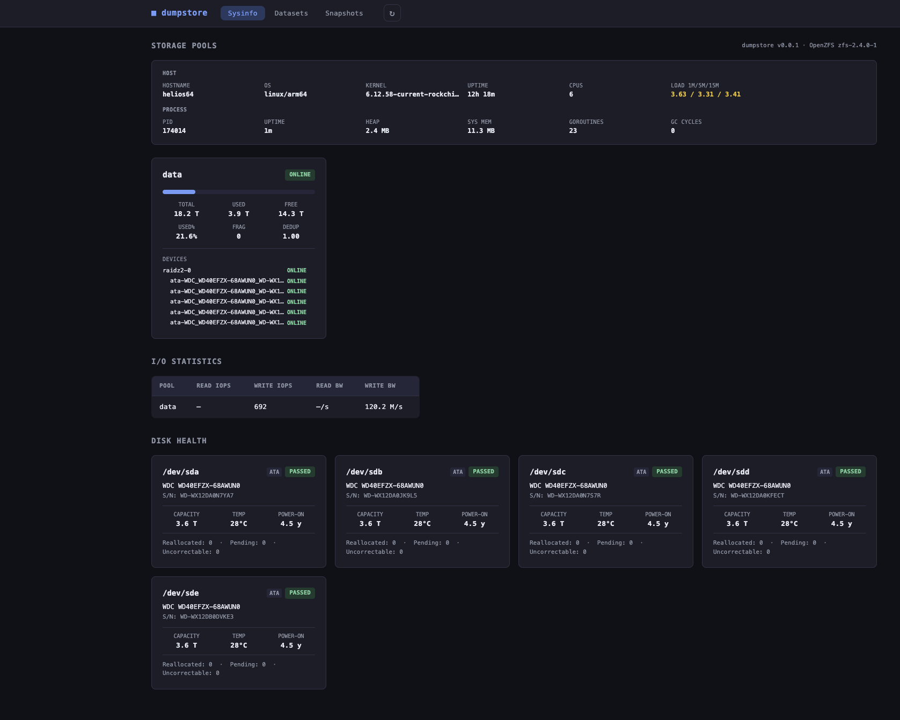
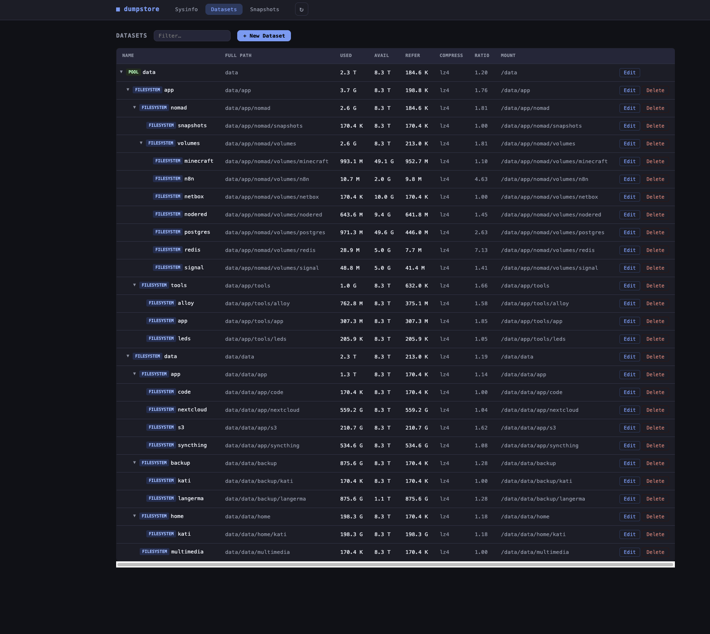
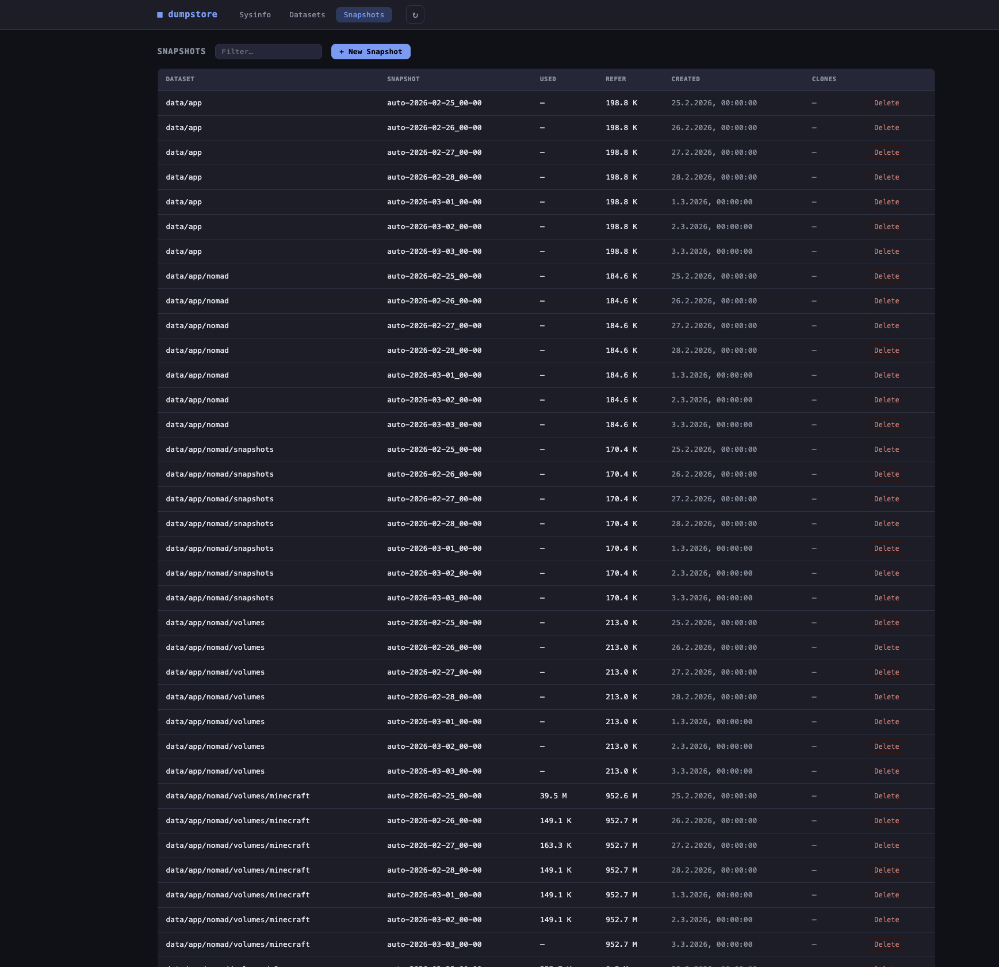
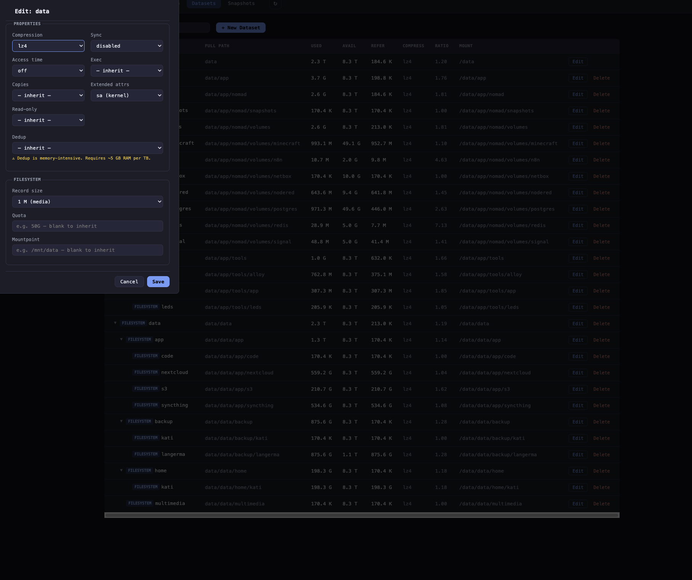

<div align="center">
  <picture>
    <source media="(prefers-color-scheme: dark)" srcset="images/dumpstore-blue-dark-lockup.svg">
    
  </picture>
</div>

<p align="center">A lightweight NAS management UI written in Go — built for Linux and FreeBSD, designed to stay out of the way of a vanilla system.</p>

## Why this exists

I run a [Kobol Helios64](https://wiki.kobol.io/helios64/intro/) as my home NAS — a five-bay ARM board that deserves better than the software ecosystem currently offers it. The existing storage UIs I tried were either too heavy, too opinionated about the underlying distribution, or simply unmaintained. None of them gave me a clean, no-nonsense window into my ZFS pools without pulling in a container runtime, a database, or a Node.js server alongside them.

What I wanted was simple: observe and manage my storage from a browser, on a machine that stays as close to a vanilla Linux or FreeBSD installation as possible. No agents, no daemons-within-daemons, no frameworks that outlive their welcome. Just a single compiled binary, some Ansible playbooks, and a handful of static files.

dumpstore started as exactly that — a thin read-only dashboard — and is growing deliberately from there. The roadmap includes everything a real NAS UI needs: SMB/NFS share management, fine-grained permissions, and ZFS send/receive. Each feature will follow the same philosophy: keep the host clean, keep the code auditable, and let the operating system do the heavy lifting.

If you run a Helios64, an old server, or any ZFS box where you care about what is actually installed on it, this might be the tool for you.

## Features

- **System info** — hostname, OS, kernel, CPU, uptime, load averages, process stats
- **Pool overview** — health badges, usage bars, fragmentation, deduplication ratio, vdev tree
- **Pool scrub management** — trigger and cancel scrubs; last scrub time, status, and progress per pool; configure periodic scrub schedules (Linux: `zfsutils-linux`; FreeBSD: `periodic.conf`)
- **I/O statistics** — live read/write IOPS and bandwidth per pool
- **Disk health** — S.M.A.R.T. data per drive (temperature, power-on hours, reallocated sectors, pending sectors, uncorrectable errors)
- **Dataset browser** — depth-indented collapsible tree, compression, quota, mountpoint; ACL, NFS, and SMB buttons light up when configured
- **Dataset creation** — create filesystems and volumes with any combination of ZFS properties
- **Dataset editing** — update properties in place (set or inherit)
- **Dataset deletion** — destroy datasets and volumes with recursive option and confirm-by-typing dialog
- **Snapshot management** — list, create (recursive), and delete snapshots; all deletions use a styled confirm dialog
- **Auto-snapshot scheduling** — manage `com.sun:auto-snapshot*` ZFS properties per dataset; integrates with `zfs-auto-snapshot` (Linux) and `zfstools` (FreeBSD) for configurable hourly/daily/weekly/monthly rotation
- **User management** — list, create, edit (shell, password, primary/supplementary groups, home directory, SSH authorized keys, Samba password sync), and delete local users; system users (uid < 1000) hidden by default with a toggle to reveal them
- **Group management** — list, create, edit (name, GID, members), and delete local groups; system groups hidden by default with the same toggle
- **NFS share management** — enable, configure, and disable NFS sharing per dataset via the ZFS `sharenfs` property; cross-platform (Linux and FreeBSD)
- **SMB share management** — create and remove Samba usershares per dataset via `net usershare`; manage Samba users (add/remove from `smbpasswd`); one-click Samba setup (`smb_setup.yml` configures usershares, disables `[homes]`, enables PAM passthrough on Linux); cross-platform (Linux and FreeBSD)
- **SMB home shares** — enable and configure the Samba `[homes]` section in `smb.conf` so each authenticated user automatically gets a personal share mapped to a subdirectory; configurable base path (pick a ZFS dataset or specify a custom path), browseable, read only, create mask, and directory mask
- **Time Machine shares** — create Samba shares configured as macOS Time Machine backup targets using `vfs_fruit` with catia and streams_xattr; multiple named shares each backed by a different ZFS dataset; configurable max size quota and valid users per share
- **iSCSI target management** — expose ZFS volumes as iSCSI targets via `targetcli`/LIO on Linux or `ctld` on FreeBSD; per-zvol dialog with IQN (auto-generated, editable), portal IP/port, auth mode (None/CHAP), and initiator ACL list
- **ACL management** — view, add, and remove POSIX ACL entries (`getfacl`/`setfacl`, requires `acl` package) and NFSv4 ACL entries (`nfs4_getfacl`/`nfs4_setfacl`, requires `nfs4-acl-tools`) per dataset; setting an ACL entry automatically sets the correct `acltype` ZFS property; one-click enable for datasets with `acltype=off`; recursive apply supported for POSIX
- **Live updates** — Server-Sent Events push pool, dataset, snapshot, I/O, user and group changes; server polls every 10 s and pushes only on change; falls back to 30 s REST polling if SSE is unavailable
- **Prometheus metrics** — `GET /metrics` exposes Go runtime and process stats, HTTP request counters and latency histograms (`http_requests_total`, `http_request_duration_seconds`), and Ansible playbook metrics (`ansible_runs_total`, `ansible_run_duration_seconds`)
- **Request ID correlation** — every request gets a unique `req_id` carried on all log lines for that request; reads `X-Request-ID` from upstream proxies (nginx, Traefik) and echoes it back on the response
- **Audit logging** — every mutating operation (dataset/snapshot/user/group/ACL/SMB/iSCSI/scrub create, modify, destroy) emits a structured `slog` audit line with `remote_ip`, `action`, `target`, and `outcome` (`ok`/`err`); `req_id` is included automatically

## Screenshots

<table>
<tr>
<td></td>
<td></td>
</tr>
<tr>
<td></td>
<td></td>
</tr>
<tr>
<td></td>
<td></td>
</tr>
<tr>
<td></td>
<td></td>
</tr>
</table>

## Architecture

### High-level overview

```
┌─────────────────────────────────────────────────────────────────────┐
│                     Browser  (vanilla JS SPA)                       │
│  state + reactive store → subscribe(keys, renderFn)                 │
│  storeSet(key, val) auto-dispatches subscribed renderers            │
│                                                                     │
│  ┌─ boot ──────────────────────────────────────────────────────┐    │
│  │  loadAll() → 14 parallel REST fetches (initial paint)       │    │
│  │    storeBatch() coalesces updates; each render fires once   │    │
│  │  startSSE() → EventSource /api/events?topics=…              │    │
│  │    on message: storeSet(key, data) → auto render            │    │
│  │    on close:   fallback to setInterval(loadAll, 30 000)     │    │
│  │                + retry SSE after 5 s                        │    │
│  └─────────────────────────────────────────────────────────────┘    │
└──────────────────────────┬──────────────────────────────────────────┘
                           │ HTTP :8080  (REST + SSE)
                           ▼
┌─────────────────────────────────────────────────────────────────────┐
│                          main.go                                    │
│  • flag: -addr  -dir  -debug                                        │
│  • startup: checks ansible-playbook in PATH,                        │
│             playbooks/ and static/ dirs exist                       │
│  • signal.NotifyContext → graceful shutdown on SIGTERM/SIGINT       │
│  • requestLogger middleware (method/path/status/ms/req_id)          │
│    ↳ reads X-Request-ID from proxy, generates one if absent,        │
│      echoes it back on the response, stores in ctx for slog         │
│  • GET /      → http.FileServer  (static/)                          │
│  • /api/*     → api.Handler                                         │
└───────────────────┬─────────────────────────────────────────────────┘
                    │
      ┌─────────────┼───────────────────────────────┐
      │             │                               │
      │     ┌───────┴──────────────────┐            │
      │     │  internal/broker         │            │
      │     │                          │            │
      │     │  Broker — pub/sub core   │◄── StartPoller() goroutine
      │     │    Subscribe(topic)      │    polls ZFS + users/groups every 10 s
      │     │    Publish(topic, data)  │    publishes only on change
      │     │    Unsubscribe(topic,ch) │    (JSON equality check)
      │     │                          │
      │     │  GET /api/events         │──► streams SSE to browsers
      │     │    ?topics=pool.query,…  │    fan-in per-topic channels
      │     └──────────────────────────┘
      │
      ├─── READ requests                    WRITE requests ───────────┐
      │  pools, datasets, snapshots,      create / edit / destroy     │
      │  iostat, status, props,           datasets, snapshots,        │
      │  sysinfo, SMART, metrics,         users, groups, ACLs,        │
      │  users, groups, ACLs,             SMB users/shares/config,    │
      │  SMB users/shares/homes,          dataset chown, scrub,       │
      │  iSCSI targets,                   iSCSI targets,              │
      │  Time Machine shares              SMB homes config,           │
      │                                   Time Machine shares         │
      │                                                               │
      ▼                                                               ▼
┌───────────────────────┐                        ┌────────────────────────────┐
│  internal/zfs/zfs.go  │                        │ internal/ansible/runner.go │
│  internal/system/     │                        │                            │
│  internal/smart/      │                        │  Run(playbook, extraVars)  │
│  internal/iscsi/      │                        │                            │
│                       │                        │                            │
│  ListPools()          │                        │  exec: ansible-playbook    │
│  ListDatasets()       │                        │    -i inventory/localhost  │
│  ListSnapshots()      │                        │    --extra-vars '{...}'    │
│  IOStats()            │                        │  env: ANSIBLE_STDOUT_      │
│  GetDatasetProps()    │                        │    CALLBACK=ndjson         │
│  GetDatasetACL()      │                        │                            │
│  GetMountpointOwner() │                        │                            │
│  PoolStatuses()       │                        │  parse ndjson output       │
│  Version()            │                        │  → []TaskStep              │
│  system.Get()         │                        │  streams live via SSE      │
│  system.ListUsers()   │                        │                            │
│  system.ListGroups()  │                        │                            │
│  system.ListSamba*()  │                        │                            │
│  system.ParseSMBHomes()│                       │                            │
│  smart.Collect()      │                        │                            │
│  iscsi.ListTargets()  │                        │                            │
│                       │                        │                            │
│  exec: zpool / zfs /  │                        │                            │
│  smartctl / sysctl /  │                        │                            │
│  pdbedit / net        │                        │                            │
│  (no Python startup)  │                        │                            │
└──────────┬────────────┘                        └────────────┬───────────────┘
           │                                                  │
           ▼                                                  ▼
     ZFS kernel                                       playbooks/*.yml
     subsystem                                        ┌──────────────────────┐
                                                      │  targets: localhost  │
                                                      │  gather_facts: false │
                                                      │  1. assert vars      │
                                                      │  2. mutating command │
                                                      └──────────────────────┘
```

### Why the read/write split?

| Concern         | Reads                              | Writes                               |
|-----------------|------------------------------------|--------------------------------------|
| **Mechanism**   | `exec.Command(zpool/zfs/smartctl)` | `exec.Command(ansible-playbook)`.    |
| **Latency**     | Fast — no Python startup           | ~1-2 s — acceptable for mutations    |
| **Output**      | Parsed from tab-separated stdout   | Parsed from ndjson callback output   |
| **Audit trail** | None needed                        | Task names + changed/failed per step |
| **Idempotency** | N/A                                | Enforced by playbook assert tasks    |

### Request flow for a write operation

```
Browser
  │  POST /api/snapshots  {"dataset":"tank/data","snapname":"bkp"}
  ▼
handlers.go: createSnapshot()
  │  validate input (no @;|&$` chars)
  │  build extraVars map
  ▼
runner.go: Run("zfs_snapshot_create.yml", vars)
  │  marshal vars → --extra-vars '{"dataset":"tank/data",...}'
  │  set ANSIBLE_STDOUT_CALLBACK=ndjson
  ▼
ansible-playbook (subprocess)
  │  assert: dataset defined, no bad chars
  │  command: zfs snapshot tank/data@bkp
  ▼
runner.go: parse JSON stdout → PlaybookOutput → []TaskStep
  ▼
handlers.go: return 201 {"snapshot":"tank/data@bkp","tasks":[...]}
  ▼
Browser: showOpLog() renders task steps in modal
```

### Route map

```
GET  /api/sysinfo             → /proc/*, sysctl     (direct)
GET  /api/network             → net.Interfaces()    (direct)
GET  /api/version             → zpool version       (direct)
GET  /api/pools               → zpool list          (direct)
GET  /api/poolstatus          → zpool status        (direct)
GET  /api/datasets            → zfs list            (direct)
GET  /api/dataset-props/{n}   → zfs get             (direct)
GET  /api/snapshots           → zfs list -t snap    (direct)
GET  /api/iostat              → zpool iostat        (direct)
GET  /api/smart               → smartctl            (direct)
GET  /metrics                 → Prometheus text     (direct)
GET  /api/events              → SSE stream          (broker)

POST   /api/datasets          → zfs_dataset_create.yml    (ansible)
PATCH  /api/datasets/{n}      → zfs_dataset_set.yml       (ansible)
DELETE /api/datasets/{n}      → zfs_dataset_destroy.yml   (ansible)
POST   /api/snapshots         → zfs_snapshot_create.yml   (ansible)
DELETE /api/snapshots/{n}     → zfs_snapshot_destroy.yml  (ansible)

GET    /api/users                    → /etc/passwd               (direct)
POST   /api/users                    → user_create.yml           (ansible)
PUT    /api/users/{name}             → user_modify.yml           (ansible)
DELETE /api/users/{name}             → user_delete.yml           (ansible)
GET    /api/users/{name}/sshkeys     → ~/.ssh/authorized_keys    (direct)
POST   /api/users/{name}/sshkeys     → user_ssh_key_add.yml      (ansible)
DELETE /api/users/{name}/sshkeys     → user_ssh_key_remove.yml   (ansible)

GET    /api/groups            → /etc/group                (direct)
POST   /api/groups            → group_create.yml          (ansible)
PUT    /api/groups/{name}     → group_modify.yml          (ansible)
DELETE /api/groups/{name}     → group_delete.yml          (ansible)

GET    /api/chown/{dataset}   → stat(mountpoint)          (direct)
POST   /api/chown/{dataset}   → dataset_chown.yml         (ansible)

GET    /api/acl-status         → getfacl / acltype         (direct)
GET    /api/acl/{dataset}     → getfacl / nfs4_getfacl    (direct)
POST   /api/acl/{dataset}     → acl_set_posix.yml         (ansible)
                                acl_set_nfs4.yml
DELETE /api/acl/{dataset}     → acl_remove_posix.yml      (ansible)
                                acl_remove_nfs4.yml

GET    /api/smb-shares        → net usershare list        (direct)
GET    /api/smb-users         → pdbedit -L                (direct)
POST   /api/smb-share/{ds}    → smb_usershare_set.yml     (ansible)
DELETE /api/smb-share/{ds}    → smb_usershare_unset.yml   (ansible)
POST   /api/smb-users/{name}  → smb_user_add.yml          (ansible)
DELETE /api/smb-users/{name}  → smb_user_remove.yml       (ansible)
POST   /api/smb-config/pam    → smb_setup.yml             (ansible)

GET    /api/smb/homes          → parse smb.conf [homes]   (direct)
POST   /api/smb/homes          → smb_homes_set.yml        (ansible)
DELETE /api/smb/homes          → smb_homes_unset.yml      (ansible)

GET    /api/smb/timemachine    → parse smb.conf fruit:time machine  (direct)
POST   /api/smb/timemachine    → smb_timemachine_set.yml  (ansible)
DELETE /api/smb/timemachine/{n}→ smb_timemachine_unset.yml (ansible)

GET    /api/auto-snapshot/{ds} → zfs get com.sun:auto-snapshot* (direct)
PUT    /api/auto-snapshot/{ds} → zfs_autosnap_set.yml           (ansible)

GET    /api/iscsi-targets      → parse targetcli saveconfig.json or /etc/ctl.conf (direct)
POST   /api/iscsi-targets      → iscsi_target_create.yml / iscsi_target_create_freebsd.yml (ansible)
DELETE /api/iscsi-targets      → iscsi_target_delete.yml / iscsi_target_delete_freebsd.yml (ansible)
```

## Authentication

dumpstore has built-in session-based authentication.

**First-time setup:** `install.sh` prompts for a password before starting the service. On subsequent upgrades the prompt is skipped if a password is already set.

To set or reset the password manually:

```bash
sudo /usr/local/lib/dumpstore/dumpstore --set-password --config /etc/dumpstore/dumpstore.conf
sudo systemctl restart dumpstore
```

If no password is configured the service starts but **binds to `127.0.0.1` only** with a warning in the logs.

**Configuration** (`/etc/dumpstore/dumpstore.conf`, JSON):

```json
{
  "username": "admin",
  "password_hash": "$2a$12$...",
  "session_ttl": "24h",
  "trusted_proxies": ["127.0.0.1/32"],
  "unprotected_paths": ["/metrics"]
}
```

**Reverse proxy delegation:** If you run dumpstore behind nginx, Caddy, or Authelia, configure the proxy's CIDR in `trusted_proxies` and set the `X-Remote-User` header from your SSO. dumpstore will accept that header as the authenticated identity without requiring a password login.

**In-app settings:** Username and password can be changed from the Authentication section at the top of the Users & Groups tab. Both operations go through Ansible and show the operation log.

## Security

dumpstore runs as root (required for ZFS). See [SECURITY.md](SECURITY.md) for notes on TLS and the recommended deployment topology.

## Requirements

|                        | Linux                                                     | FreeBSD                                      |
|------------------------|-----------------------------------------------------------|----------------------------------------------|
| ZFS                    | `zfsutils-linux` or equivalent                            | built-in (`zfsutils` pkg for older releases) |
| Ansible                | `ansible` package (Python 3)                              | `py311-ansible` or equivalent                |
| Service manager        | systemd                                                   | rc.d (via `daemon(8)`)                       |
| S.M.A.R.T. (optional)  | `smartmontools`                                           | `smartmontools` pkg                          |
| POSIX ACLs (optional)  | `acl` pkg (`getfacl`/`setfacl`)                           | `py311-pylibacl` or `acl` port               |
| NFS sharing (optional) | `nfs-kernel-server` (Debian) or `nfs-utils` (RHEL/Fedora) | built-in base system                         |
| SMB sharing (optional) | `samba` (`smbd`, `net`, `pdbedit`); for ZFS ACL passthrough via `sharesmb` also install `samba-vfs-modules` (Debian/Ubuntu) or `samba-vfs` (RHEL/Fedora) | `samba` pkg |
| NFSv4 ACLs (optional)  | `nfs4-acl-tools` pkg (`nfs4_getfacl`/`nfs4_setfacl`)      | `nfs4-acl-tools` port                        |
| iSCSI (optional)       | `targetcli-fb` (`targetcli`)                               | built-in `ctld`                              |
| Build                  | Go 1.22+                                                  | Go 1.22+                                     |

Go and Ansible are the only hard requirements. ZFS must be available on the target machine; the binary itself builds and runs on any platform.

The NFS server and ACL tools are optional — the relevant dialogs will show an error if the required tool is not installed. Install only what you need:

```bash
# Debian/Ubuntu — POSIX ACLs
apt install acl

# Debian/Ubuntu — NFS sharing
apt install nfs-kernel-server
systemctl enable --now nfs-server

# Debian/Ubuntu — NFSv4 ACLs
apt install nfs4-acl-tools

# RHEL/Fedora — NFS sharing
dnf install nfs-utils
systemctl enable --now nfs-server

# RHEL/Fedora — ACLs
dnf install acl nfs4-acl-tools

# Debian/Ubuntu — SMB sharing
apt install samba
# Then run the SMB setup from the dumpstore UI (Settings → Configure Samba)
# or manually: ansible-playbook playbooks/smb_setup.yml

# Debian/Ubuntu — iSCSI targets
apt install targetcli-fb

# RHEL/Fedora — iSCSI targets
dnf install targetcli

# FreeBSD — iSCSI targets (ctld is built-in, just enable the service)
sysrc ctld_enable=YES
service ctld start
```

## Contributing

Contributions are welcome. Please read [CONTRIBUTING.md](CONTRIBUTING.md) before opening a PR — it covers the no-external-dependencies rule, the read/write split convention, playbook and frontend standards, and the docs update requirement.

Bug reports and feature requests go through the [issue tracker](https://github.com/langerma/dumpstore/issues) using the provided templates.

This project follows a [Code of Conduct](CODE_OF_CONDUCT.md).

## Versioning

Releases are tagged with semver (`v0.1.0`, `v0.2.0`, …). The version is injected at build time via ldflags from `git describe`:

```
v0.1.0                 ← exact tag
v0.1.0-3-gabcdef       ← 3 commits after tag
v0.1.0-3-gabcdef-dirty ← uncommitted changes present
dev                    ← built outside git (no tags)
```

The version is exposed in:
- `./dumpstore -version` — prints and exits
- `GET /api/sysinfo` → `app_version` field
- `GET /metrics` → `dumpstore_build_info{version="..."}` label
- UI version bar (alongside the OpenZFS version)

## Build & Install

### Using the install script (recommended)

Clone the repository and run `install.sh` as root. It checks prerequisites, builds the binary, installs everything to `/usr/local/lib/dumpstore/`, and registers the service.

```bash
git clone https://github.com/langerma/dumpstore.git
cd dumpstore
sudo ./install.sh
```

To remove dumpstore completely:

```bash
sudo ./install.sh --uninstall
```

### Using make

`make install` detects the OS automatically and registers the appropriate service.

```bash
# Tag a release (optional — omitting gives "dev" as version)
git tag v0.1.0

# Build and install
make build
sudo make install
```

The service will be available at `http://localhost:8080`.

### Linux (systemd)

The unit file is installed to `/etc/systemd/system/dumpstore.service`.

To change the listen address:
```bash
# Edit ExecStart in the unit file, then:
sudo systemctl daemon-reload && sudo systemctl restart dumpstore
```

### FreeBSD (rc.d)

The rc script is installed to `/usr/local/etc/rc.d/dumpstore`. The installer runs `sysrc dumpstore_enable=YES` automatically.

To customise address or install path, add to `/etc/rc.conf`:
```
dumpstore_enable="YES"
dumpstore_addr=":9090"
dumpstore_dir="/usr/local/lib/dumpstore"
```
Then `service dumpstore restart`.

## Run without installing

```bash
go build -o dumpstore .
sudo ./dumpstore -addr :8080 -dir .
```

`-dir` must point to the directory that contains `playbooks/` and `static/`. It defaults to the directory of the executable.

## Uninstall

```bash
sudo make uninstall
```

## Project layout

```
.
├── main.go                          # HTTP server, flag parsing, startup dependency checks
├── go.mod
├── internal/
│   ├── zfs/zfs.go                   # Direct zpool/zfs command execution (reads)
│   ├── zfs/acl.go                   # GetDatasetACL — getfacl/nfs4_getfacl parsing
│   ├── ansible/runner.go            # Ansible playbook execution + JSON output parsing
│   ├── api/handlers.go              # Shared infra: validation helpers, Handler struct, RegisterRoutes, SSE
│   ├── api/zfs_handlers.go          # ZFS handlers: pools, datasets, snapshots, scrub, chown, auto-snapshot
│   ├── api/user_handlers.go         # User + group handlers, SSH key management
│   ├── api/acl_handlers.go          # ACL handlers (POSIX + NFSv4)
│   ├── api/smb_handlers.go          # SMB handlers: shares, users, homes, Time Machine
│   ├── api/iscsi_handlers.go        # iSCSI target handlers
│   ├── broker/broker.go             # Thread-safe pub/sub broker (Subscribe/Publish/Unsubscribe)
│   ├── broker/poller.go             # Background poller (ZFS + users/groups) → publishes changes to broker
│   ├── system/system.go             # Host + process info, ListUsers, ListGroups (/proc, /etc/passwd, /etc/group)
│   ├── iscsi/iscsi.go              # iSCSI target listing (targetcli on Linux, ctld on FreeBSD)
│   └── smart/smart.go              # S.M.A.R.T. data via smartctl
├── playbooks/
│   ├── inventory/localhost          # Local connection inventory
│   ├── zfs_dataset_create.yml       # Create filesystem or volume
│   ├── zfs_dataset_set.yml          # Update dataset properties (set / inherit)
│   ├── zfs_dataset_destroy.yml      # Destroy dataset or volume
│   ├── zfs_snapshot_create.yml      # Create snapshot
│   ├── zfs_snapshot_destroy.yml     # Destroy snapshot
│   ├── user_create.yml              # Create local user
│   ├── user_modify.yml              # Modify user (shell, groups, password)
│   ├── user_delete.yml              # Delete user and home directory
│   ├── group_create.yml             # Create local group
│   ├── group_modify.yml             # Modify group (name, GID, members)
│   ├── group_delete.yml             # Delete local group
│   ├── acl_set_posix.yml            # Add/modify POSIX ACL entry (setfacl -m)
│   ├── acl_remove_posix.yml         # Remove POSIX ACL entry (setfacl -x)
│   ├── acl_set_nfs4.yml             # Add NFSv4 ACL entry (nfs4_setfacl -a)
│   ├── acl_remove_nfs4.yml          # Remove NFSv4 ACL entry (nfs4_setfacl -x)
│   ├── smb_setup.yml                # Configure Samba: usershares dir, disable [homes], PAM passthrough
│   ├── smb_usershare_set.yml        # Create/update a Samba usershare for a dataset
│   ├── smb_usershare_unset.yml      # Remove a Samba usershare
│   ├── smb_user_add.yml             # Add a local user to smbpasswd
│   ├── smb_user_remove.yml          # Remove a user from smbpasswd
│   ├── smb_homes_set.yml            # Enable/update [homes] section in smb.conf
│   ├── smb_homes_unset.yml          # Remove [homes] section from smb.conf
│   ├── smb_timemachine_set.yml      # Create/update Time Machine share in smb.conf (vfs_fruit)
│   ├── smb_timemachine_unset.yml    # Remove Time Machine share from smb.conf
│   ├── iscsi_target_create.yml      # Create iSCSI target (Linux/targetcli)
│   ├── iscsi_target_delete.yml      # Remove iSCSI target (Linux/targetcli)
│   ├── iscsi_target_create_freebsd.yml  # Create iSCSI target (FreeBSD/ctld)
│   └── iscsi_target_delete_freebsd.yml  # Remove iSCSI target (FreeBSD/ctld)
├── images/                          # Logo source files (SVG, all variants)
├── static/
│   ├── index.html                   # Single-page application shell + dialogs
│   ├── app.js                       # Vanilla JS frontend, no dependencies
│   ├── style.css                    # Dark monospace theme
│   └── images/                      # Logos served by the HTTP file server
├── contrib/
│   ├── dumpstore.service            # systemd unit file (Linux)
│   └── dumpstore.rc                 # rc.d script (FreeBSD)
├── install.sh                       # Standalone build-and-install script (Linux & FreeBSD)
└── Makefile                         # OS-aware build / install / uninstall
```

## API

| Method | Path | Description |
|--------|-----------------------------|---------------------------------------|
| GET    | `/api/sysinfo`              | Host and process info                 |
| GET    | `/api/version`              | OpenZFS version string                |
| GET    | `/api/pools`                | List all pools with usage stats       |
| GET    | `/api/poolstatus`           | Detailed pool status with vdev tree   |
| GET    | `/api/datasets`             | List all datasets and volumes         |
| GET    | `/api/dataset-props/{name}` | Editable properties for a dataset     |
| GET    | `/api/snapshots`            | List all snapshots                    |
| GET    | `/api/iostat`               | Pool I/O statistics (1-second sample) |
| GET    | `/api/smart`                | S.M.A.R.T. health per disk            |
| GET    | `/api/events`               | Server-Sent Events stream (see below) |
| GET    | `/metrics`                  | Prometheus text exposition            |
| POST   | `/api/datasets`             | Create a dataset or volume            |
| PATCH  | `/api/datasets/{name}`      | Update dataset properties             |
| DELETE | `/api/datasets/{name}`      | Destroy a dataset or volume           |
| POST   | `/api/snapshots`            | Create a snapshot                     |
| DELETE | `/api/snapshots/{name}`     | Destroy a snapshot                    |
| GET    | `/api/users`                | List local users                      |
| POST   | `/api/users`                | Create a local user                   |
| PUT    | `/api/users/{name}`         | Edit user (shell, groups, password)   |
| DELETE | `/api/users/{name}`         | Delete user and home directory        |
| GET    | `/api/groups`               | List local groups                     |
| POST   | `/api/groups`               | Create a local group                  |
| PUT    | `/api/groups/{name}`        | Edit group (name, GID, members)       |
| DELETE | `/api/groups/{name}`        | Delete a local group                  |
| GET    | `/api/chown/{dataset}`      | Get mountpoint owner and group        |
| POST   | `/api/chown/{dataset}`      | Set mountpoint owner and/or group     |
| GET    | `/api/acl-status`           | ACL presence map (dataset → bool)     |
| GET    | `/api/acl/{dataset}`        | Get ACL entries for a dataset         |
| POST   | `/api/acl/{dataset}`        | Add or modify an ACL entry            |
| DELETE | `/api/acl/{dataset}`        | Remove an ACL entry                   |
| GET    | `/api/smb-shares`           | List all active Samba usershares      |
| POST   | `/api/smb-share/{dataset}`  | Create or update a Samba usershare    |
| DELETE | `/api/smb-share/{dataset}`  | Remove a Samba usershare              |
| GET    | `/api/smb-users`            | List users registered in smbpasswd   |
| POST   | `/api/smb-users/{name}`     | Add a user to smbpasswd               |
| DELETE | `/api/smb-users/{name}`     | Remove a user from smbpasswd          |
| POST   | `/api/smb-config/pam`       | Run Samba setup playbook              |
| GET    | `/api/smb/homes`            | Get current SMB [homes] config        |
| POST   | `/api/smb/homes`            | Enable/update SMB [homes] section     |
| DELETE | `/api/smb/homes`            | Disable/remove SMB [homes] section    |
| GET    | `/api/smb/timemachine`      | List all Time Machine shares          |
| POST   | `/api/smb/timemachine`      | Create/update a Time Machine share    |
| DELETE | `/api/smb/timemachine/{name}` | Remove a Time Machine share         |
| GET    | `/api/iscsi-targets`        | List all iSCSI targets                |
| POST   | `/api/iscsi-targets`        | Create an iSCSI target for a zvol     |
| DELETE | `/api/iscsi-targets`        | Remove an iSCSI target                |
| GET    | `/api/services`             | List status of managed services (Samba, NFS, iSCSI) |
| POST   | `/api/services/{name}/{action}` | Control a service (start/stop/restart/enable/disable) |

### POST /api/datasets

```json
{
  "name": "tank/data",
  "type": "filesystem",
  "compression": "lz4",
  "quota": "50G",
  "mountpoint": "/mnt/data",
  "recordsize": "128K",
  "atime": "off",
  "exec": "on",
  "sync": "standard",
  "dedup": "off",
  "copies": "1",
  "xattr": "sa"
}
```

For volumes, use `"type": "volume"` and add `"volsize": "10G"`. Optional: `"volblocksize"`, `"sparse": true`.

### PATCH /api/datasets/{name}

Body is a JSON object with any subset of editable properties. An empty string value resets the property to inherited; a non-empty value sets it explicitly. Unknown properties are ignored.

```json
{
  "compression": "zstd",
  "quota": "",
  "readonly": "on"
}
```

Editable properties: `compression`, `quota`, `mountpoint`, `recordsize`, `atime`, `exec`, `sync`, `dedup`, `copies`, `xattr`, `readonly`, `acltype`, `sharenfs`, `sharesmb`.

### DELETE /api/datasets/{name}

Append `?recursive=true` to also destroy all child datasets and snapshots.

Pool roots (e.g. `tank`) cannot be deleted via this endpoint — use `zpool destroy`.

### POST /api/snapshots

```json
{
  "dataset": "tank/data",
  "snapname": "2024-01-15_backup",
  "recursive": false
}
```

### DELETE /api/snapshots/{dataset}@{snapname}

Append `?recursive=true` to also destroy clones.

### GET /api/acl/{dataset}

Returns the ACL type and entries for the dataset's mountpoint.

```json
{
  "dataset": "tank/data",
  "mountpoint": "/mnt/data",
  "acl_type": "posix",
  "entries": [
    { "tag": "user",  "qualifier": "",      "perms": "rwx", "default": false },
    { "tag": "user",  "qualifier": "alice", "perms": "r-x", "default": false },
    { "tag": "group", "qualifier": "",      "perms": "r-x", "default": false },
    { "tag": "mask",  "qualifier": "",      "perms": "rwx", "default": false },
    { "tag": "other", "qualifier": "",      "perms": "---", "default": false }
  ]
}
```

`acl_type` is one of `"posix"`, `"nfsv4"`, or `"off"`. Entries are empty when `acl_type` is `"off"` or the dataset has no mountpoint.

For NFSv4 datasets each entry has the form:
```json
{ "tag": "A", "flags": "fd", "qualifier": "OWNER@", "perms": "rwaDxtTnNcCoy" }
```

### POST /api/acl/{dataset}

Add or modify an ACL entry. The `ace` string format depends on the dataset's `acltype`:

- **POSIX**: `setfacl -m` spec — `"user:alice:rwx"`, `"group:storage:r-x"`, `"default:user:alice:rwx"`
- **NFSv4**: full ACE string — `"A::alice@localdomain:rwaDxtTnNcCoy"`, `"A:fd:GROUP@:rxtncoy"`

```json
{ "ace": "user:alice:rwx", "recursive": false }
```

`recursive` (POSIX only) applies `setfacl -R` to all files inside the mountpoint. Returns Ansible task steps.

### DELETE /api/acl/{dataset}?entry=\<spec\>

Remove an ACL entry. The `entry` query parameter is:

- **POSIX**: removal spec without perms — `user:alice`, `default:group:storage`
- **NFSv4**: full ACE string to match and remove

Append `&recursive=true` (POSIX only) to remove recursively.

### GET /api/iscsi-targets

List all iSCSI targets backed by ZFS volumes. Uses `targetcli` saveconfig on Linux or `/etc/ctl.conf` on FreeBSD. Returns an empty array if no backend is installed.

```json
[
  {
    "iqn": "iqn.2024-03.io.dumpstore:tank-vms-win11",
    "zvol_name": "tank/vms/win11",
    "zvol_device": "/dev/zvol/tank/vms/win11",
    "lun": 0,
    "portals": ["0.0.0.0:3260"],
    "auth_mode": "none",
    "initiators": []
  }
]
```

### POST /api/iscsi-targets

Create an iSCSI target for a ZFS volume. Auto-selects the appropriate playbook based on platform (`targetcli` on Linux, `ctld` on FreeBSD). Returns 501 if no backend is detected.

```json
{
  "zvol": "tank/vms/win11",
  "iqn": "iqn.2024-03.io.dumpstore:tank-vms-win11",
  "portal_ip": "0.0.0.0",
  "portal_port": "3260",
  "auth_mode": "none",
  "chap_user": "",
  "chap_password": "",
  "initiators": []
}
```

- `zvol` (required): ZFS volume name, must contain `/`
- `iqn` (required): RFC 3720 iSCSI Qualified Name (`iqn.YYYY-MM.domain:name`)
- `portal_ip`: listen IP, defaults to `0.0.0.0`
- `portal_port`: listen port, defaults to `3260`
- `auth_mode`: `"none"` or `"chap"`
- `chap_user` / `chap_password`: required when `auth_mode` is `"chap"`
- `initiators`: array of allowed initiator IQNs; empty array = allow all

### DELETE /api/iscsi-targets?iqn=\<iqn\>&zvol=\<zvol\>

Remove an iSCSI target and its backstore. Both query parameters are required.

### GET /api/events

Server-Sent Events stream. The server pushes named events whenever data changes, eliminating the need for the client to poll.

**Query parameter:** `topics` — comma-separated list of topic names to subscribe to.

**Available topics:**

| Topic                | Data                                            | Source                                    |
|----------------------|-------------------------------------------------|-------------------------------------------|
| `pool.query`         | Same JSON as `GET /api/pools`                   | Pushed every 10 s on change               |
| `poolstatus`         | Same JSON as `GET /api/poolstatus`              | Pushed every 10 s on change               |
| `dataset.query`      | Same JSON as `GET /api/datasets`                | Pushed every 10 s on change               |
| `autosnapshot.query` | Same JSON as `GET /api/auto-snapshot-schedules` | Pushed every 10 s on change               |
| `snapshot.query`     | Same JSON as `GET /api/snapshots`               | Pushed every 10 s on change               |
| `iostat`             | Same JSON as `GET /api/iostat`                  | Pushed every 10 s always                  |
| `user.query`         | Same JSON as `GET /api/users`                   | Pushed on write op + every 10 s on change |
| `group.query`        | Same JSON as `GET /api/groups`                  | Pushed on write op + every 10 s on change |
| `service.query`      | Same JSON as `GET /api/services`                | Pushed every 10 s on change               |

Each event follows the SSE wire format:

```
event: pool.query
data: [{"name":"tank","health":"ONLINE",...}]

event: iostat
data: [{"pool":"tank","read_ops":0,"write_ops":443,...}]
```

Example — watch pool health and I/O live:

```bash
curl -N 'http://localhost:8080/api/events?topics=pool.query,iostat'
```

The browser UI uses `EventSource` to subscribe to all eight topics and falls back to 30 s REST polling automatically if the SSE connection is lost. User and group topics are also published immediately after any write operation so the UI reflects changes without waiting for the next poll cycle.

## Planned

| Feature                  | Notes                                                                                         |
|--------------------------|-----------------------------------------------------------------------------------------------|
| Dataset rename           | Rename a dataset or volume in place                                                           |
| Snapshot clone           | Create a new dataset from an existing snapshot                                                |
| ~~Auto-snapshot scheduling~~ | ~~Hourly/daily/weekly/monthly rotation policies~~ — **done** (`com.sun:auto-snapshot*` ZFS properties; integrates with `zfs-auto-snapshot` / `zfstools`) |
| ZFS native encryption    | Load/unload keys, show encryption status per dataset, support keyformat/keylocation           |
| ~~iSCSI target management~~ | ~~Expose zvols as iSCSI targets~~ — **done** (`targetcli`/LIO on Linux, `ctld` on FreeBSD; IQN, portal, CHAP, initiator ACLs) |
| Pool import/export       | Import available pools from attached devices; export pools safely                             |
| Snapshot diff            | Show files changed between two snapshots (`zfs diff`)                                         |
| Per-user quota tracking  | Show space usage per user/group (`zfs userspace` / `zfs groupspace`)                          |
| ~~User mgmt extensions~~ | ~~SSH key management (`authorized_keys`), move home directory~~ — **done** (SSH authorized key add/remove, home directory change with optional file migration, Samba password sync on edit) |
| ~~Samba home shares~~    | ~~Enable/configure `[homes]` section in `smb.conf` for per-user home directory shares~~ — **done** (enable/disable `[homes]` section; configurable base path, browseable, read only, create/directory masks) |
| ~~Time Machine shares~~  | ~~Samba `vfs_fruit` share configuration for macOS Time Machine backups over SMB~~ — **done** (named shares backed by ZFS datasets; configurable max size and valid users; `vfs_fruit` with catia and streams_xattr) |
| ZFS send/receive         | Pool replication and off-site backup                                                          |
| Alerts                   | Configurable thresholds for pool health, disk temp, capacity                                  |
| ~~Pool scrub management~~| ~~Trigger scrubs, view last scrub time/status/progress, schedule periodic scrubs~~ — **done** (start/cancel + periodic schedule; Linux `zfsutils-linux`, FreeBSD `periodic.conf`) |
| ~~NFS share management~~ | ~~List, create, and remove NFS exports~~ — **done** (ZFS `sharenfs` property; cross-platform)         |
| ~~SMB share management~~ | ~~List, create, and remove Samba shares~~ — **done** (`net usershare`; Samba user management; setup playbook) |
